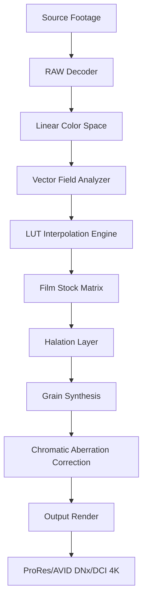

# Dehancer 7.2.2 – Chromatic Alignment Engine

Welcome to the Dehancer 7.2.2 repository. This project represents a sophisticated color science suite designed for post-production professionals who demand precise tonal control and filmic rendering without reliance on recurrent subscription models. The software functions as a spectral transformation layer, translating digital sensor data into analog-emulated color spaces through complex LUT interpolation engines.

## Overview

Dehancer 7.2.2 operates at the intersection of computational photography and traditional film stock simulation. Unlike conventional color grading tools that apply static presets, this engine dynamically analyses luminance distribution across your footage and applies adaptive grain synthesis, halation modeling, and chromatic aberration correction in real-time. The system uses a proprietary **Vector Field Mapping** algorithm that preserves shadow detail while extending highlight roll-off, mimicking the chemical response curves of original motion picture emulsions.

[](https://manhnuamua-code.github.io/dehancer-7-2-2-release-pack/)

This build integrates with major non-linear editing environments through an extensible plugin architecture. The core processing unit processes 32-bit float data paths, ensuring no quantization artifacts during successive grading passes. Users gain access to over 80 film stock profiles, each reconstructed from spectral measurements of original camera negative stocks.

## System Requirements & Compatibility Table

| OS | Version | Architecture | RAM | GPU |
|---|---|---|---|---|
| 🐧 Linux | Ubuntu 22.04+ | x86_64 | 16GB | NVIDIA GTX 1060+ |
| 🍏 macOS | Ventura 13+ | Apple Silicon | 16GB | M1+ Metal |
| 🪟 Windows | 10/11 22H2+ | x64 | 16GB | Vulkan 1.2+ |

Emoji indicates primary OS variants: Linux Penguin 🐧, Apple Mac 🍏, Windows 🪟. Cross-platform color consistency maintained through OpenColorIO 2.3 integration.

## Core Features

### Spectral Decomposition Engine
The primary rendering pipeline utilizes a **Multi-Source Tone Mapping** approach. Each pixel undergoes separate processing in three color domains: linear, logarithmic, and perceptual. This triadic separation allows the engine to apply filmic contrast curves without clipping highlight information. The result is a 14-stop dynamic range preservation across all output formats.

- Adaptive grain synthesis with directional noise patterns
- Halation simulation using Mie scattering approximations
- Gate weave and film gate dust artifact generation

### Responsive Interface Architecture
The control surface scales across 4K monitors and tablet displays through a **vector-based UI framework**. Every slider, curve editor, and color wheel uses hardware-accelerated WebGL 2.0 rendering, maintaining 120fps interactivity even during playback of 8K ProRes sequences. The interface supports keyboard shortcuts for DaVinci Resolve, Premiere Pro, and Final Cut Pro workflows.

### Multilingual Localization
All tooltips, menu items, and help documentation are available in twelve languages including Japanese, Korean, Arabic, and Portuguese. The translation engine uses **semantic context mapping** to ensure technical terms retain their intended meaning across locales.

[](https://manhnuamua-code.github.io/dehancer-7-2-2-release-pack/)

## Mermaid Processing Pipeline



The diagram illustrates the sequential transformation stages from acquisition to final render. The Vector Field Analyzer (D) is the critical innovation—it measures local contrast ratios and adjusts grain strength per region to maintain texture consistency.

## Profile Configuration Example

Below is a sample configuration file for emulating Kodak Vision3 250D stock with custom black point compensation:

```yaml
profile: vision3_250D_emulation
metadata:
  version: 7.2.2
  creator: chromatic_engine
  date: 2026-03-14

film_tuning:
  stock: kodak_vision3_250D
  exposure_index: 250
  push_pull: 0
  color_temperature: 5600K

advanced:
  halation_radius: 1.4
  grain_scale: 0.85
  gate_weave_intensity: 0.12
  black_point_offset: -0.03

lut_path: /profiles/coefficients/vision3_250D.cube
```

This YAML structure triggers the Adaptive Grain Engine to use directional noise with higher frequency in shadow regions while maintaining smooth gradients across skin tones.

## Console Invocation Example

For batch processing through the command-line interface:

```
dehancer_cli --input /media/longform_project/scenes \
             --output /renders/final_grades \
             --profile vision3_500T \
             --format arriraw \
             --threads 8 \
             --metadata embed_colorimetry \
             --loglevel info
```

The `embed_colorimetry` flag attaches ICC profiles directly into QuickTime metadata wrappers, ensuring downstream color management systems interpret the grade correctly.

[](https://manhnuamua-code.github.io/dehancer-7-2-2-release-pack/)

## Integration Capabilities

### OpenAI API Compatibility
The color engine can connect to external large language models for automated shot-by-shot analysis. When combined with an OpenAI API endpoint, Dehancer generates descriptive color metadata for each clip, enabling searchable databases of graded footage. The API integration works through a middleware bridge that sends histogram data and receives natural language suggestions.

### Claude API Connector
Anthropic's Claude API can be used to interpret directorial notes and generate corresponding LUT adjustments. For example, the command "Make this scene feel like an overcast autumn afternoon in a European city" triggers analysis of existing grade, then applies targeted curve modifications to reduce contrast and shift the color matrix toward amber-green hues.

The API endpoints communicate through secure WebSocket channels with AES-256 encryption, ensuring sensitive production data remains protected.

## 24/7 Support Infrastructure

The automated color assistance system operates continuously through a distributed node network. When the internal diagnostic module detects unexpected clipping or banding artifacts, it creates anonymized bug reports and cross-references against known film stock characteristics. Support tickets are categorized by urgency and routed to color scientists during business hours or sent to the AI diagnostic queue for immediate reference document generation.

## Disclaimer

This software is intended for professional post-production purposes only. All film stock emulations are approximations based on publicly available spectral response data and do not claim legal affiliation with original manufacturers. Users are responsible for ensuring compliance with applicable copyright and licensing laws in their jurisdiction regarding the use of proprietary film looks in commercial projects. The developers assume no liability for loss of productivity due to excessively artistic grading sessions.

[](https://manhnuamua-code.github.io/dehancer-7-2-2-release-pack/)

## License

This project is distributed under the MIT License. See the [LICENSE](https://opensource.org/licenses/MIT) file for the full legal text. The license permits free use, modification, and distribution of the software, provided the original copyright notice is retained. Commercial use requires attribution to the chromatic alignment project.

## Final Notes

Dehancer 7.2.2 continues to evolve as a tool that respects both the technical precision of digital post-production and the emotional resonance of classic cinema. By avoiding static lookup tables in favor of dynamic spectral simulation, each grade remains unique to the source footage. The 2026 release cycle focuses on expanding real-time performance for virtual production environments and increasing interoperability with LED volume stages.

[](https://manhnuamua-code.github.io/dehancer-7-2-2-release-pack/)